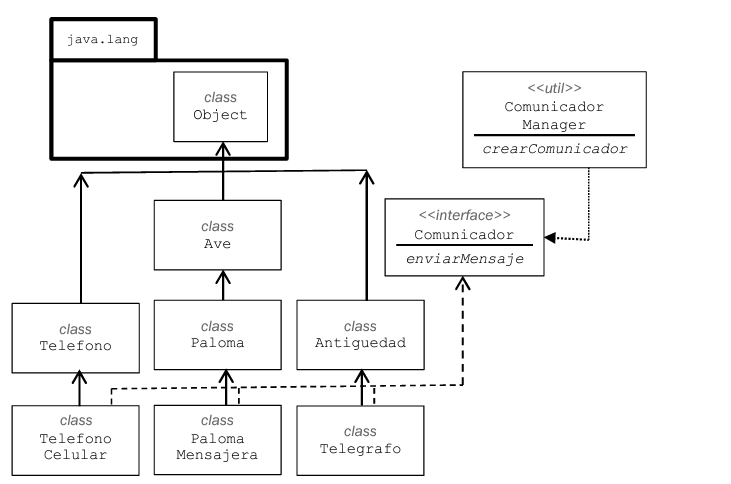

# Interface and factory objects

If a class inherits an abstract method and does not overwrite must be declared as an `abstract` class.
We can say that an `interface` is an abstract class but that is not exactly like that. Exists a difference between
`interface` and an `abstract class`:
- Abstract classes can be extended(with word: `extends`)
- Interfaces can be implemented(with word: `implements`)

One class can only inherits from one class; and mulitple interfaces can be implemented
of which is going to inherit `abstract` methods that must be overwritten.

In this program we use `CommunicatorManager` to get an instance of `Communicator` and send a message through it

What if we modify the method `createCommunicator` of `CommunicatorManager` and
instead returning an `MessengerPigeon` instance we return `CellPhone`

Nothing...

Because we remove  of know whats the type instance, and our code was decoupled

So with `createCommunicator` method of class `CommunicatorManager` can be classified as `FACTORY METHOD`.

## Interface Comparable

This interface declares just one method: `compareTo` that compares an object that is received as parameter with the own instance
on which the method is being executed
